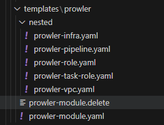

## Nested Stacks Pipeline Modules ##

- [Nested Stacks Pipeline Modules](#nested-stacks-pipeline-modules)
- [Overview](#overview)
- [Current Available Modules](#current-available-modules)
- [Solution Pipeline Process](#solution-pipeline-process)
  - [Pipeline Stages](#pipeline-stages)
    - [Source Stage](#source-stage)
    - [Build Stage](#build-stage)
    - [Deploy Stage](#deploy-stage)
- [Validation Remediation Steps](#validation-remediation-steps)
- [Delete Module Stack Feature](#delete-module-stack-feature)

## Overview ##
These are the general instructions for how the pipeline scripts run and how to utilise the process

See each individual module located in this folder structure for more information on each solution

## Current Available Modules ##

| Solution | SourceCode | Documentation | Deployment Solution |
| -------- | ---------- | ------------- | ------------------- |
| SSO | [Code](./DevOps/Nested-Stacks-Pipeline/CloudFormation-Modules/templates/SSO/)| [ReadMe](./DevOps/Nested-Stacks-Pipeline/CloudFormation-Modules/templates/SSO/readme.md) | Nested Stacks Pipeline |
| VPC Flowlogs | [Code](./DevOps/Nested-Stacks-Pipeline/CloudFormation-Modules/templates/VPC-Flowlogs/)| [ReadMe](./DevOps/Nested-Stacks-Pipeline/CloudFormation-Modules/templates/VPC-Flowlogs/readme.md)  | Nested Stacks Pipeline |
| Prowler (Infrastructure) | [Code](./DevOps/Nested-Stacks-Pipeline/CloudFormation-Modules/templates/Prowler/)| [ReadMe](/templates/Prowler/readme.md) | Nested Stacks Pipeline |


## Solution Pipeline Process ##

**Pipeline: `Org-Nested-Stacks`**

### Pipeline Stages ###

- *[Source Stage](#source-stage)*
- *[Build Stage](#build-stage)*
- *[Deploy Stage](#deploy-stage)*

#### Source Stage ####

- `Nested-Stack-Modules` is the default name for the repo when you created the pipeline from CfCT, copy the layot to your repo, any updates to this repo will initiate the pipeline.
- An example of the folder structure must be as follows

    ```md
    Nested-Stack-Modules
    ├── parameters
    │   └── prowler-module-parameters.json
    ├── scripts
    │   ├── build.sh
    │   ├── deploy.sh
    │   └── validate.sh
    └── templates
        └── prowler (Or any other required solution)
            |── prowler-module.yaml (Root Module Stack)
            └── nested (Stacks)
                ├── prowler-infra.yaml
                ├── prowler-pipeline.yaml
                ├── prowler-role.yaml
                ├── prowler-task-role.yaml
                └── prowler-vpc.yaml
    ```

___

#### Build Stage ####

- `OrgNestedStacks-Build-CodeBuild` is the Project to carry out build of CloudFormation Nested Stacks. The Build Stage is configured in the buildspec to run 3 phases, install phase to prep the container including `python`, `ruby`, `awscli` and `cfn-nag`, build.sh in the build phase and validate.sh in the post_build phase.

    ```yaml
    version: 0.2
    phases:
    install:
        runtime-versions:
        python: 3.11
        ruby: 3.2
        commands:
        - yum update -y
        - pip3 install --upgrade pip
        - pip3 install awscli --upgrade --quiet
        - gem install --quiet cfn-nag -v 0.8.10
    build:
        commands:
        - echo Entered the build phase...
        - ls
        - bash scripts/build.sh $TEMPLATE_BUCKET
    post_build:
        on-failure: ABORT
        commands:
        - echo Entered the post_build phase...
        - bash scripts/validate.sh
    artifacts:
    files:
        - "**/*"
    name: Packaged
    ```

    - **[build.sh](./scripts/build.sh)**

        The job of the build bash is to itterate through the [templates](./templates/) folder to find the root module yaml for each solution

        - Checks for a `<MODULE-NAME>-module.delete` file for the solution
        - Collects the `<MODULE-NAME>-module.yaml` for the solution
        - Packages up the template based off the corresponding `<MODULE-NAME>-parameters.json` if found
        - Copies all required files to the `s3://$TEMPLATE_BUCKET` and copies the template in to the `$package_folder`

    - **[validate.sh](./scripts/validate.sh)**

        The job of the validate bash is to itterate through the [templates](./templates/) and the [parameters](./parameters/) folders for all of the solutions for validation and testing, in line with the CfCT tests.

        - Performs `aws cloudformation validate-template` on each template
        - Performs `cfn_nag_scan` on each template
        - Runs json validation on each `$parameter_file_name`
___

#### Deploy Stage ####

- `OrgNestedStacks-Deployment-CodeBuild` is th Project to carry out deployment of CloudFormation Nested Stacks. The Deploy Stage is configured to run a single build phase that runs build.sh

    ```yaml
    version: 0.2
    phases:
    install:
        commands:
        - yum update -y
        - pip3 install --upgrade pip
        - pip3 install awscli --upgrade --quiet
    build:
        commands:
        - ls
        - bash scripts/deploy.sh $TEMPLATE_BUCKET $ROLE_ARN
    ```

    - **[deploy.sh](./scripts/deploy.sh)**

        The job of the deploy bash is to itterate through the [templates](./templates/) files for all of the solutions for  deployment

        - Checks for a `<MODULE-NAME>-module.delete` file for the solution
        - If found checks for current Stack
            - If found deletes it
            - else responds to confim files can be cleaned up
        - If no delete is found it collects the `<MODULE-NAME>-module.yaml` for the solution in the `$package_folder`
        - Deploys the template based off the corresponding `<MODULE-NAME>-parameters.json` if found

## Validation Remediation Steps ##

Examples for Pipeline aborting due to failing validation.

`aws cloudformation validate-template` and how to remediate.

1.  Failures will show as below

    ```
    Running aws cloudformation validate-template on templates/prowler/nested/prowler-infra.yaml
    An error occurred (ValidationError) when calling the ValidateTemplate operation: Template format error: Unresolved resource dependencies [pProwlerContainerUri] in the Resources block of the template
    ERROR: CloudFormation template failed validation - templates/prowler/nested/prowler-infra.yaml
    ^^^ Caught an error: Setting exit status flag to 1 ^^^
    ```
2. You will need to establish the correct configuration i.e. the missing parameter entryin the code to correct, or the section in the template.

    ```yaml
    Parameters:
    pProwlerContainerUri:
        Type: String
        Description: ECR URI of the Prowler container
    ```
3. After you add the correct code you will see the pass output

    ```text
    Running aws cloudformation validate-template on templates/prowler/nested/prowler-infra.yaml
    {
        "Parameters": [
            {
                "ParameterKey": "pProwlerContainerUri",
                "NoEcho": false,
                "Description": "ECR URI of the Prowler container"
            }
            ...
        ],
        "Description": "This Template will create the infrastructure for running Prowler as a Fargate container",
        "Capabilities": [
            "CAPABILITY_IAM"
        ],
        "CapabilitiesReason": "The following resource(s) require capabilities: [AWS::IAM::Role]"
    }
    ```

  `cfn_nag_scan` and how to remediate.

1.  Failures will show as below
    ```text
    Running cfn_nag_scan on templates/prowler/nested/prowler-infra.yaml
    ------------------------------------------------------------
    templates/prowler/nested/prowler-infra.yaml
    ------------------------------------------------------------------------------------------------------------------------
    | FAIL F38
    |
    | Resource: ["rCWEventECSTriggerRole"]
    | Line Numbers: [418]
    |
    | IAM role should not allow * resource with PassRole action on its permissions policy
    Failures count: 1
    Warnings count: 4
    ERROR: CFN Nag failed validation - templates/prowler/nested/prowler-infra.yaml
    ^^^ Caught an error: Setting exit status flag to 1 ^^^
    ```
2.  You will need to establish the correct configuration i.e. the Fail code to suppres or correct, for the metadata section in the template
    ```yaml
    rCWEventECSTriggerRole:
        Type: 'AWS::IAM::Role'
        Metadata:
        cfn_nag:
            rules_to_suppress:
            - id: F38
                reason: "For passing role to ECS Service"
    ```

3.  After you add the section and you will see the cfn_nag_scan complete successfully

    ```text
    Running cfn_nag_scan on templates/prowler/nested/prowler-infra.yaml
    ------------------------------------------------------------
    templates/prowler/nested/prowler-infra.yaml
    ------------------------------------------------------------------------------------------------------------------------
    | WARN W11
    |
    | Resource: ["rCWEventECSTriggerRole"]
    | Line Numbers: [418]
    |
    | IAM role should not allow * resource on its permissions policy
    ------------------------------------------------------------
    Failures count: 0
    Warnings count: 4
    ```

`json tool` and how to remediate.

1.  Failures will show as below

    ```
    Changing path to parameters directory: /codebuild/output/src1414716885/src/parameters
    Running json validation on prowler-module-parameters.json
    Expecting ',' delimiter: line 6 column 5 (char 198)
    ERROR: CloudFormation parameter file failed validation - prowler-module-parameters.json
    ^^^ Caught an error: Setting exit status flag to 1 ^^^
    Exiting script with status: 1
    ERROR: One or more validation test(s) failed.
    ```
2.  You will need to establish the correct configuration for the json in the template as pointed out by the linter.

    ```json
      {
        "ParameterKey": "pS3BaseURLForNestedTemplates",
        "ParameterValue": "https://nested-stacks-codepipeline-artefacts-eu-west-2-xxxxxxxxxx.s3.eu-west-2.amazonaws.com/"
    }<,>
    {
        "ParameterKey": "pCodeCommitRepositoryName",
        "ParameterValue": "Prowler"
    },
    ```
3.  After you correct the section and you will see the json linter tool complete successfully

    ```text
    Changing path to parameters directory: /codebuild/output/src2536424438/src/parameters
    Running json validation on prowler-module-parameters.json
    [
        {
            "ParameterKey": "pS3BaseURLForNestedTemplates",
            "ParameterValue": "https://nested-stacks-codepipeline-artefacts-eu-west-2-xxxxxxxxxx.s3.eu-west-2.amazonaws.com/"
        },
        {
            "ParameterKey": "pCodeCommitRepositoryName",
            "ParameterValue": "Prowler"
        },
    ...
    ]
    Exiting script with status: 0
    INFO: Validation test(s) completed.
    ```

## Delete Module Stack Feature ##

The pipeline supports deleting the stacks you created, simply add a `<MODULE-NAME>-module.delete` file to the root of the module, this will trigger the build.sh and deploy.sh to process the deletion of the deployed stack.

- The following is an example of delete for the prowler module



- You will see in the logs a corresponding deletion in both the [Build](#build-stage) and [Deploy](#deploy-stage) stages

**Build Output**
```log
[Container] 2023/11/16 10:23:43.051828 Running command bash scripts/build.sh $TEMPLATE_BUCKET

templates/prowler/prowler-module.yaml

>>>>> prowler
prowler-module

delete flag file: templates/prowler/prowler-module.delete found, copying the delete flag file ready for Stack delete in Deploy phase...

```

**Deploy Output**

```text
[Container] 2023/11/15 23:54:20.439689 Running command bash scripts/deploy.sh $TEMPLATE_BUCKET $ROLE_ARN

Processing prowler-module.delete

checking for prowler-module stack

found Stack arn:aws:cloudformation:eu-west-2:835093175455:stack/prowler-module/e81784c0-83ec-11ee-bb15-02f8cb16ad0c

deleting prowler-module

```

- The logic is located here

```bash
if [ -e $templates_sub_folder/$delete_file ]
        then
                echo -e "\nchecking for ${template%.*} stack"
                StackId=$(aws cloudformation describe-stacks --stack-name ${template%.*} --query 'Stacks[].StackId' --output text 2> /dev/null)
                if [ $StackId ]
                then
                        echo -e "\nfound stack $StackId"
                        echo "deleting ${template%.*}"
                        aws cloudformation delete-stack --stack-name ${template%.*}
                else
                        echo -e "\nstack not found"
                        echo "stack doesnt exist, you can now delete any templates for ${template%.*} from the repo"
                fi
```