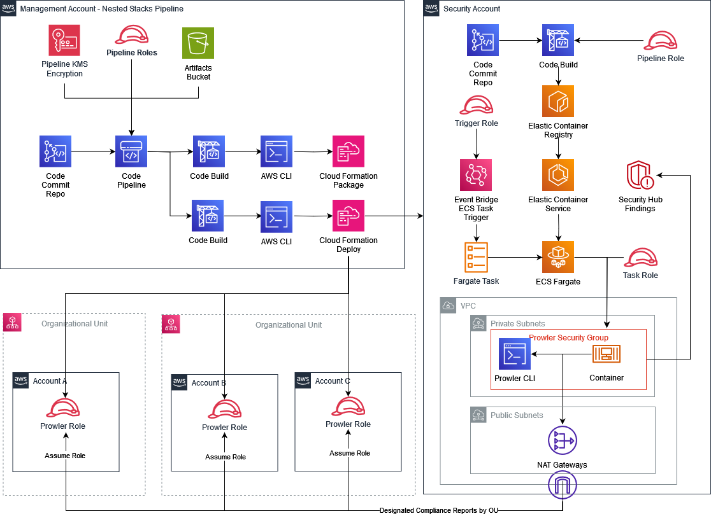

# Prowler Module
- [Prowler Module](#prowler-module)
  - [Architecture Overview](#architecture-overview)
  - [Pre-Requisites for the Solution](#pre-requisites-for-the-solution)
  - [Pre-Requisites for `Prowler Module` into the Nested Stacks Pipeline](#pre-requisites-for-prowler-module-into-the-nested-stacks-pipeline)
  - [Installation for `Prowler Module` into the Nested Stacks Pipeline](#installation-for-prowler-module-into-the-nested-stacks-pipeline)
  - [Upload of the build files to the `Prowler Module` CodeCommit repo for docker build](#upload-of-the-build-files-to-the-prowler-module-codecommit-repo-for-docker-build)
  - [Operational configuration considerations for `Prowler Module`](#operational-configuration-considerations-for-prowler-module)

## Architecture Overview



## Pre-Requisites for the Solution
- There is an overarching assumption that you already have [Customisation for Control Tower](https://aws.amazon.com/solutions/implementations/customizations-for-aws-control-tower/) deployed within your Control Tower Environment along with the [Security Reference Architecture (SRA)](https://github.com/aws-samples/aws-security-reference-architecture-examples).

- Before deployment you are required to initialise the Nested Stacks pipeline from CfCT. [Nested Stacks Pipeline](../../../readme.md)

    i.e. `Repo deployed with at least a scripts folder and running pipeline`

## Pre-Requisites for `Prowler Module` into the Nested Stacks Pipeline
1. Copy the following yaml files into your `Nested-Stack-Modules` repo in the Control Tower Management Account in to the templates folder

    - `prowler-infra.yaml`
    - `prowler-pipeline.yaml`
    - `prowler-role.yaml`
    - `prowler-task-role.yaml`
    - `prowler-vpc.yaml`

    copy to the following structure

    - `templates\prowler\nested\` (Case sensative)

## Installation for `Prowler Module` into the Nested Stacks Pipeline
1.  Copy the CloudFormation Template `prowler-module.yaml` to the `/templates` folder for use with Customisations for Control Tower.
2.  Copy the CloudFormation Parameters `prowler-module-parameters.json` to the `/parameters` folder for use with Customisations for Control Tower.
3.  Update the CloudFormation Parameters `prowler-module-parameters.json` with the required details:


    | ParameterKey | Description | DefaultValue |
    | ------------ | ----------- | ------------ |
    | pGLCTSolutionVersion | The Global Logic solution version. Used to trigger updates on the nested StackSets. | v1.0 |
    | pS3BaseURLForNestedTemplates | The S3 tempaltes bucket use in the Nested Stacks Pipeline | https://nested-stacks-codepipeline-artefacts-{region}-{account_id}.s3.{region}.amazonaws.com/ |
    | pCodeCommitRepositoryName | Name of Prowler Code Commit Repository | Prowler |
    | pECRRepositoryName | Name of Prowler ECR Repository | Prowler |
    | pVpcId | VPC Id to launch network resources in |  |
    | pSubnetIds | Comma-separated list of Subnet Ids |  |
    | pCreateVpc | Use this to deploy a VPC rather than an existing VPC Id to launch network resources in | False |
    | pVpcCidr | The CIDR to be used for the VPC to be created if pCreateVpc = True to launch network resources in | 192.168.0.0/24 |
    | pHomeRegion | Input the Home Region. |  |
    | pStandardProwlerReports | The standard compliance reports to run on all accounts. |  |
    | pAdditionalProwlerReports | The additional compliance reports to run on accounts in specified OU. |  |
    | pAdditionalProwlerReportsOUs | The specified OU for the additional compliance reports to run (Seperated by spaces). |  |

Examples Below:

```json
[
    {
        "ParameterKey": "pGLCTSolutionVersion",
        "ParameterValue": "v1.0"
    },
    {
        "ParameterKey": "pS3BaseURLForNestedTemplates",
        "ParameterValue": "https://nested-stacks-codepipeline-artefacts-{region}-{account_id}.s3.{region}.amazonaws.com/"
    },
    {
        "ParameterKey": "pCodeCommitRepositoryName",
        "ParameterValue": "Prowler"
    },
    {
        "ParameterKey": "pECRRepositoryName",
        "ParameterValue": "prowler"
    },
    {
        "ParameterKey": "pVpcId",
        "ParameterValue": ""
    },
    {
        "ParameterKey": "pSubnetIds",
        "ParameterValue": ""
    },
    {
        "ParameterKey": "pCreateVpc",
        "ParameterValue": "True"
    },
    {
        "ParameterKey": "pVpcCidr",
        "ParameterValue": "192.168.0.0/24"
    },
    {
        "ParameterKey": "pHomeRegion",
        "ParameterValue": "eu-west-2"
    },
    {
        "ParameterKey": "pStandardProwlerReports",
        "ParameterValue": "iso27001_2013_aws nist_800_53_revision_5_aws nist_800_171_revision_2_aws"
    },
    {
        "ParameterKey": "pAdditionalProwlerReports",
        "ParameterValue": "hipaa_aws"
    },
    {
        "ParameterKey": "pAdditionalProwlerReportsOUs",
        "ParameterValue": "Production"
    }
]
```

The below Parameters are some of the examples used for Tagging Purposes and cannot be left blank.

| ParameterKey | Description | DefaultValue |
| ------------ | ----------- | ------------ |
| pTagEnvironment | Distinguish between Production & Non-Production Environments AWS Accounts. | |
| pTagSDLC | Distinguish between SDLC Environments e.g., Dev, Test, SIT, UAT. ||
| pTagApplicationName | Identify resources that are related to a specific application. ||
| pTagApplicationRole | Identify the function of a particular respource e.g., Web Server, Message Broker, Database Server. ||
| pTagCluster | Identify resource farms that share a common configuration and that perform a specific function for an application. ||
| pTagDataClassification | Identify the specific compliance requirements that resources must adhere to e.g., FedRAMP Moderate, Australian Cyber, ITAR etc. | Private |
| pTagCompliance | Identify the specific data confidentiality level a resource supports. ||
| pTagDataRetention | Identify the data retention policy applied to a resource. | 365 |
| pTagMapMigrated | Identify resources that have been migrated as part of the AWS Migration Acceleration Program (MAP) for funding purposes. ||
| pTagProjectName | Identify the project that the resource supports. ||
| pTagProductOwner | Identify who is commercially responsible for the resource. ||
| pTagTechnicalOwner | Identify who is technically responsible for the resource. ||
| pTagCostCenter | Identify the cost center associated with a resource, typically for cost allocation and tracking. ||
| pTagBusinessUnit | Identify the business unit associated with a resource, typically for cost allocation and tracking. ||
| pTagBusinessImpact | Identify the business impact associated with a resource e.g., Critical, High, Medium, Low. | Medium |
| pTagEscalationPath | Identify the next point of contact for a resource in an incident e.g, DevOps Team, 3rd Party Company. ||
| pTagKnowledgeBase | Identify the location for knowledge base article or wiki associated with the resource. ||
| pTagHoursOfOperation | Identify the hours of operation for a resource e.g., 24*7, 06:00 – 22:00 Monday – Friday, 08:00 – 18:00 Monday – Friday. | 24x7 |
| pTagMaintenanceWindow | Identify the hours in which.a resource is available for maintenance occur ||
| pTagBackupSchedule | Identify the backup schedule for a resource. ||
| pTagOptOut | Identify whether a resource should be excluded from maintenance activities e.g., True, False. | False |
| pTagDeploymentMethod | Identify the method by which the resource was deployed e.g., CloudFormation, Terraform, Manual. | CloudFormation |


```json
[
    {
        "ParameterKey": "pTagEnvironment",
        "ParameterValue": ""
    },
    {
        "ParameterKey": "pTagSDLC",
        "ParameterValue": ""
    },
    {
        "ParameterKey": "pTagApplicationName",
        "ParameterValue": ""
    },
    {
        "ParameterKey": "pTagApplicationRole",
        "ParameterValue": ""
    },
    {
        "ParameterKey": "pTagCluster",
        "ParameterValue": ""
    },
    {
        "ParameterKey": "pTagDataClassification",
        "ParameterValue": "Private"
    },
    {
        "ParameterKey": "pTagCompliance",
        "ParameterValue": ""
    },
    {
        "ParameterKey": "pTagDataRetention",
        "ParameterValue": "365"
    },
    {
        "ParameterKey": "pTagMapMigrated",
        "ParameterValue": ""
    },
    {
        "ParameterKey": "pTagProjectName",
        "ParameterValue": ""
    },
    {
        "ParameterKey": "pTagProductOwner",
        "ParameterValue": ""
    },
    {
        "ParameterKey": "pTagTechnicalOwner",
        "ParameterValue": ""
    },
    {
        "ParameterKey": "pTagCostCenter",
        "ParameterValue": ""
    },
    {
        "ParameterKey": "pTagBusinessUnit",
        "ParameterValue": ""
    },
    {
        "ParameterKey": "pTagBusinessImpact",
        "ParameterValue": "Medium"
    },
    {
        "ParameterKey": "pTagEscalationPath",
        "ParameterValue": ""
    },
    {
        "ParameterKey": "pTagKnowledgeBase",
        "ParameterValue": ""
    },
    {
        "ParameterKey": "pTagHoursOfOperation",
        "ParameterValue": "24x7"
    },
    {
        "ParameterKey": "pTagMaintenanceWindow",
        "ParameterValue": ""
    },
    {
        "ParameterKey": "pTagBackupSchedule",
        "ParameterValue": ""
    },
    {
        "ParameterKey": "pTagOptOut",
        "ParameterValue": "False"
    },
    {
        "ParameterKey": "pTagDeploymentMethod",
        "ParameterValue": "CloudFormation"
    }
]
```

## Upload of the build files to the `Prowler Module` CodeCommit repo for docker build

The build for the prowler docker container is established by the build project deployed by the prowler-module.  Once deployed you will need to upload the `dockerfile` and the `run_prowler.sh` to the codecommit repo from our CTaaS repo  

Here: [Security-and-Governance/Prowler/](../../../../../Security-and-Governance/Prowler/)

1. The CodeCommit repo will be created in the Security Account, you will need to establish a SSO / programmatic session to the account and ensure that you have git: `remote-codecommit` installed locally
2. Once you have a session git clone the repo to your machine with the relevant command based on your setup. i.e.
   ```bash
   git clone codecommit::eu-west-2://Prowler
   # Or if using profiles
   git clone codecommit://<PROFILE>@Prowler
   ```
3. Git add the files as above then commit and push
    ```bash
    git add .
    git commit -m "Initial Commit"
    git push
    ```
4. The push to the repo will launch the build and will automatically deploy the latest version of the Prowler container.

## Operational configuration considerations for `Prowler Module`

Consider the following for your configuration when deciding the values for the `prowler-module-parameters.json`

1. Establish that the repo naming convention suits. i.e. `prowler`
2. Establish if you will be using a existing VPC or you will be using the `pCreateVpc` flag parameter.  
   - If you plan on using an existing you will require the VpcId and the subnetIds
   - Else you will be required to either use the default CIDR or chose a relevant one for the pVpcCidr parameter
   - NOTE: Further work is being developed to provide the means of using IPAM for the VPC - TBD
3. Ensure the correct pHomeRegion is supplied
4. Finally you will need to establish which OUs will need to run which compliance scans
    - `pStandardProwlerReports` is a list (Separated by spaces) of the reports from the available prowler configuration that you wish to run on all accounts
    - `pAdditionalProwlerReports` is optional for any further scans you wish to run on any number of a specific set of OUs
    - `pAdditionalProwlerReportsOUs` the list (Separated by spaces) of OUs to run the additional scans on.
