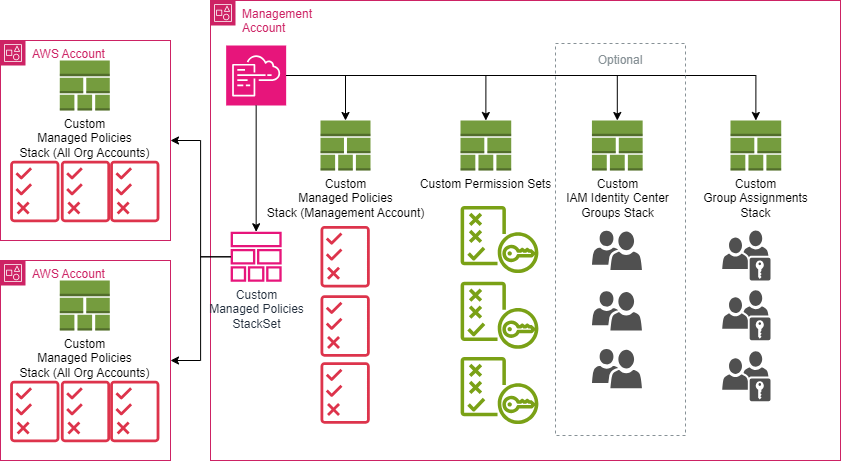
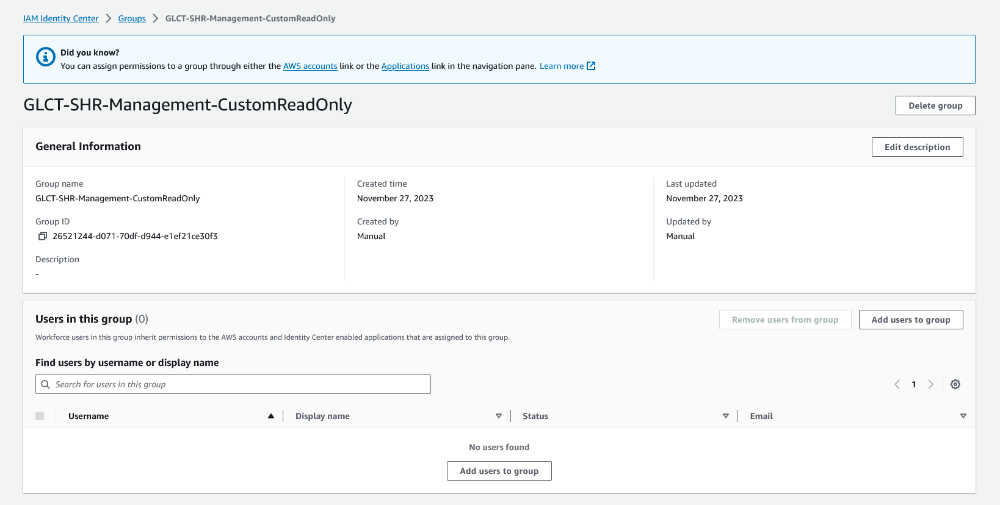

# SSO Module
- [SSO Module](#sso-module)
  - [Architecture Overview](#architecture-overview)
  - [Pre-Requisites for the Solution](#pre-requisites-for-the-solution)
  - [Pre-Requisites for `SSO Module` into the Nested Stacks Pipeline](#pre-requisites-for-sso-module-into-the-nested-stacks-pipeline)
  - [Installation for `SSO Module` into the Nested Stacks Pipeline](#installation-for-sso-module-into-the-nested-stacks-pipeline)

## Architecture Overview



## Pre-Requisites for the Solution
- There is an overarching assumption that you already have [Customisation for Control Tower](https://aws.amazon.com/solutions/implementations/customizations-for-aws-control-tower/) deployed within your Control Tower Environment along with the [Security Reference Architecture (SRA)](https://github.com/aws-samples/aws-security-reference-architecture-examples).

- Before deployment you are required to initialise the Nested Stacks pipeline from CfCT. [Nested Stacks Pipeline](../../../readme.md)

    i.e. `Repo deployed with at least a scripts folder and running pipeline`

## Pre-Requisites for `SSO Module` into the Nested Stacks Pipeline
1. Copy the following yaml files into your `Nested-Stack-Modules` repo in the Control Tower Management Account in to the templates folder

    - `sso-customer-managed-policies.yaml`
    - `sso-permission-sets.yaml`

    Also depending on if the client will be using IAM Identity Center Groups you can copy

    - `sso-iam-identity-center-groups.yaml`

    Finally you can use the following for the group assignments (Please be aware that there are hard limits for resource creation and that you may need to devise a grouping stratergy ahead of the deployment) currently **Max 500** and a mappings limit of **Max 200**

    - `sso-group-assignments-foundational.yaml`
      - This is for the sole purpose of assignments in the Control Tower and Management account
    or
    - `sso-group-assignments-member-accounts.yaml`
      - As the name suggests this template is for any of the remaining accounts that you wish to add to the assignments, the separation of the accounts can be controlled here by managing your lists of accounts in to groups then applying this template on those accounts. You are require to configure a account assignment block in the mappings section of the template.

    Copy to the following structure

    - `templates\sso\nested\`

2. Update the CloudFormation Template `sso-customer-managed-policies.yaml` with the required policies, the current template has a few examples, be sure to include the policies you create in the outputs section including the Export of each for use in the `sso-permission-sets` stack.
    ```yaml
    Outputs:
    BillingAdminsIamPolicyName:
        Value: !Select [1, !Split ["/", !Ref rIamPolicyBillingAdmins]]
        Export:
        Name: StackSet-sso-customer-managed-policies-BillingAdminsIamPolicyName
    DelegatedAdminsIamPolicyName:
        Value: !Select [1, !Split ["/", !Ref rIamPolicyDelegatedAdmins]]
        Export:
        Name: StackSet-sso-customer-managed-policies-DelegatedAdminsIamPolicyName
    DevOpsAdminsIamPolicyName:
        Value: !Select [1, !Split ["/", !Ref rIamPolicyDevOpsAdmins]]
        Export:
        Name: StackSet-sso-customer-managed-policies-DevOpsAdminsIamPolicyName
    CustomDeveloperIamPolicyName:
        Value: !Select [1, !Split ["/", !Ref rIamPolicyCustomDeveloper]]
        Export:
        Name: StackSet-sso-customer-managed-policies-CustomDeveloperIamPolicyName
    CustomDeveloperLimitedIamPolicyName:
        Value: !Select [1, !Split ["/", !Ref rIamPolicyCustomDeveloperLimited]]
        Export:
        Name: StackSet-sso-customer-managed-policies-CustomDeveloperLimitedIamPolicyName
    ```
3. Update the CloudFormation Template `sso-permission-sets.yaml` with the required permissions sets based off the policies you have created, be sure to include the ARNs you create in the outputs section (no need to add the Exports this time since CF ForEach does not support dynamic ImportValue) for use in the module stack:
    ```yaml
    Outputs:
    PermissionSetBillingAdminsArn:
        Value: !GetAtt rPermissionSetBillingAdmins.PermissionSetArn
    PermissionSetDelegatedAdminsArn:
        Value: !GetAtt rPermissionSetDelegatedAdmins.PermissionSetArn
    PermissionSetDevOpsAdminsArn:
        Value: !GetAtt rPermissionSetDevOpsAdmins.PermissionSetArn
    PermissionSetReadOnlyArn:
        Value: !GetAtt rPermissionSetReadOnly.PermissionSetArn
    PermissionSetSecurityAdminsArn:
        Value: !GetAtt rPermissionSetSecurityAdmins.PermissionSetArn
    PermissionSetSecurityTeamArn:
        Value: !GetAtt rPermissionSetSecurityTeam.PermissionSetArn
    PermissionSetAdministratorAccessArn:
        Value: !GetAtt rPermissionSetAdministratorAccess.PermissionSetArn
    ```
4. Update the CloudFormation Template - Foundational Accounts `sso-group-assignments-foundational.yaml` with the required assignments, you will need to update the mappings with the relevant assignment names for the accounts and the corresponding GUIDs:

    #### Steps to update (New Account)
    1. Under each Account Name in the mappings section Update the account block to add the relevant mappings for the PermissionSets and corresponding Group PrincipalId for the account

    #### Steps to update (New Permission Set)
    2. Add the Permission Set Arn Parameter to the "Permission Set Configurations" Metadata maintaining the naming convention i.e. pPermissionSet<NEW_PERMISSION_SET_NAME>Arn
    3. Add the PermissionSetArn Parameter to the Parameters section
    4. Add the <NEW_PERMISSION_SET_NAME> and the corresponding Group PrincipalId to the required account blocks in the Account Mappings section

    ```yaml
    Mappings:
        AccountList:
            Accounts:
            Names:
                - Management
                - LogArchive
                - Security
        Management:
            Assignments:
                PermissionSets:
                - AdministratorAccess
                - ReadOnly
                - BillingAdmins
            AdministratorAccess:
                PrincipalId: '06124294-40f1-70e3-7c2b-cf5142f46f98'
            ReadOnly:
                PrincipalId: 'a6a272d4-b021-706c-5ba2-bdba230a50b3'
            BillingAdmins:
                PrincipalId: 'a6a272d4-b021-706c-5ba2-bdba230a50b3'
    ```
5. Update the CloudFormation Template - Member Accounts `sso-group-assignments-member-accounts.yaml` with the required assignments, you will need to update the mappings with the relevant assignment names for the accounts and the corresponding GUIDs:

    #### Steps to update (New Account)
    1. Add each Account Id in the mappings section of the `sso-group-assignments-member-accounts.yaml` as a new account block and add the relevant mappings for the PermissionSets and corresponding Group PrincipalId for the account
    2. In the `sso-module-parameters.json` add the account Id to the `pMemberAccountIds` parameter list as `sso-group-assignments-member-accounts.yaml`

    ```yaml
        Mappings:
        "012345678910": # Development
            Assignments:
                PermissionSets:
                - AdministratorAccess
                - ReadOnly
            AdministratorAccess:
                PrincipalId: '06124294-40f1-70e3-7c2b-cf5142f46f98'
            ReadOnly:
                PrincipalId: 'a6a272d4-b021-706c-5ba2-bdba230a50b3'
    ```

    #### Steps to update (New Permission Set)
    3. Add the Permission Set Arn Parameter to the "Permission Set Configurations" Metadata maintaining the naming convention i.e. pPermissionSet<NEW_PERMISSION_SET_NAME>Arn
    4. Add the PermissionSetArn Parameter to the Parameters section
    5. Add the <NEW_PERMISSION_SET_NAME> and the corresponding Group PrincipalId (GUID) to the required account blocks in the Account Mappings section

    ```yaml
        Mappings:
        "012345678910": # Development
            Assignments:
                PermissionSets:
                - AdministratorAccess
                - ReadOnly
                - DevOpsAdmins
            AdministratorAccess:
                PrincipalId: '06124294-40f1-70e3-7c2b-cf5142f46f98'
            ReadOnly:
                PrincipalId: 'a6a272d4-b021-706c-5ba2-bdba230a50b3'
            DevOpsAdmins:
                PrincipalId: 'a6a272d4-b021-706c-5ba2-bdba230a50b3'
    ```
6. OPTIONAL: Update the CloudFormation Template - for adding IAM Identity Center Groups `sso-iam-identity-center-groups.yaml` with the required group names based of the prefix and account names, the template will iterate through each account creating a group with the combination of parameters and mappings you supply. You will need to update the mappings with the relevant group names for the accounts:

    #### Steps to update
    1. Add each Account Name in the mappings section as a new account
    2. Add a account block and add the relevant mappings for the Groups and corresponding Group Permission Set Names for the account, if there are multiple accounts with the same name you will need to also add the relevant distinguished SDLC value.

    ```yaml
        Mappings:
        # AWS Accounts to Create Groups for List (Names)
        AccountList:
            Accounts:
            Names:
                - Development
                - Network
                - SharedServices
        Development:
            Assignments:
            PermissionSets:
                - AdministratorAccess
                - CustomReadOnly
            Environment:
            SDLC:
                - SHR
    ```
    3. The groups generated will be created with the following format, for example

    

## Installation for `SSO Module` into the Nested Stacks Pipeline
1.  Copy the CloudFormation Template `sso-module.yaml` to the `/templates` folder for use with Customisations for Control Tower.
2.  Copy the CloudFormation Parameters `sso-module-parameters.json` to the `/parameters` folder for use with Customisations for Control Tower.
3.  Update the CloudFormation Parameters `sso-module-parameters.json` with the required details:


    | ParameterKey | Description | DefaultValue |
    | ------------ | ----------- | ------------ |
    | pGLCTSolutionVersion | The Global Logic solution version. Used to trigger updates on the nested StackSets. | v1.0 |
    | pS3BaseURLForNestedTemplates | The S3 templates bucket use in the Nested Stacks Pipeline | https://nested-stacks-codepipeline-artefacts-{region}-{account_id}.s3.{region}.amazonaws.com/ |
    | pSsoInstanceArn | This is the SSO Instance ARN | The CSV list of Member accounts to which the assignments will be executed. |
    | pSsoSessionDuration | Session timeout for SSO | PT8H |
    | pRootOrganizationalUnitId | The Id for the root Organizational Unit | /sra/control-tower/root-organizational-unit-id |
    | pMemberAccountIds |  |  |
    | pCreateIamIdentityCenterGroups | Use this to deploy Iam Identity Center Group resources | False |
    | pSsoIdentityStoreId | If creating Groups in the Iam Identity Store provide the Id of the IAM Identity Center Identity Store. |  |
    | pSsoPrefix | If creating Groups in the Iam Identity Store, provide the Prefix to be used for Across all Groups for naming purposes. |  |

```json
[
    {
        "ParameterKey": "pGLCTSolutionVersion",
        "ParameterValue": "v1.0"
    },
    {
        "ParameterKey": "pS3BaseURLForNestedTemplates",
        "ParameterValue": ""
    },
    {
        "ParameterKey": "pSsoInstanceArn",
        "ParameterValue": ""
    },
    {
        "ParameterKey": "pSsoSessionDuration",
        "ParameterValue": "PT8H"
    },
    {
        "ParameterKey": "pRootOrganizationalUnitId",
        "ParameterValue": "/sra/control-tower/root-organizational-unit-id"
    },
    {
        "ParameterKey": "pMemberAccountIds",
        "ParameterValue": ""
    },
    {
        "ParameterKey": "pCreateIamIdentityCenterGroups",
        "ParameterValue": "False"
    },
    {
        "ParameterKey": "pSsoIdentityStoreId",
        "ParameterValue": ""
    },
    {
        "ParameterKey": "pSsoPrefix",
        "ParameterValue": ""
    }
]
```

The below Parameters are some of the examples used for Tagging Purposes and cannot be left blank.

| ParameterKey | Description | DefaultValue |
| ------------ | ----------- | ------------ |
| pTagEnvironment | Distinguish between Production & Non-Production Environments AWS Accounts. | |
| pTagSDLC | Distinguish between SDLC Environments e.g., Dev, Test, SIT, UAT. ||
| pTagApplicationName | Identify resources that are related to a specific application. ||
| pTagApplicationRole | Identify the function of a particular respource e.g., Web Server, Message Broker, Database Server. ||
| pTagCluster | Identify resource farms that share a common configuration and that perform a specific function for an application. ||
| pTagDataClassification | Identify the specific compliance requirements that resources must adhere to e.g., FedRAMP Moderate, Australian Cyber, ITAR etc. | Private |
| pTagCompliance | Identify the specific data confidentiality level a resource supports. ||
| pTagDataRetention | Identify the data retention policy applied to a resource. | 365 |
| pTagMapMigrated | Identify resources that have been migrated as part of the AWS Migration Acceleration Program (MAP) for funding purposes. ||
| pTagProjectName | Identify the project that the resource supports. ||
| pTagProductOwner | Identify who is commercially responsible for the resource. ||
| pTagTechnicalOwner | Identify who is technically responsible for the resource. ||
| pTagCostCenter | Identify the cost center associated with a resource, typically for cost allocation and tracking. ||
| pTagBusinessUnit | Identify the business unit associated with a resource, typically for cost allocation and tracking. ||
| pTagBusinessImpact | Identify the business impact associated with a resource e.g., Critical, High, Medium, Low. | Medium |
| pTagEscalationPath | Identify the next point of contact for a resource in an incident e.g, DevOps Team, 3rd Party Company. ||
| pTagKnowledgeBase | Identify the location for knowledge base article or wiki associated with the resource. ||
| pTagHoursOfOperation | Identify the hours of operation for a resource e.g., 24*7, 06:00 – 22:00 Monday – Friday, 08:00 – 18:00 Monday – Friday. | 24x7 |
| pTagMaintenanceWindow | Identify the hours in which.a resource is available for maintenance occur ||
| pTagBackupSchedule | Identify the backup schedule for a resource. ||
| pTagOptOut | Identify whether a resource should be excluded from maintenance activities e.g., True, False. | False |
| pTagDeploymentMethod | Identify the method by which the resource was deployed e.g., CloudFormation, Terraform, Manual. | CloudFormation |


```json
[
    {
        "ParameterKey": "pTagEnvironment",
        "ParameterValue": ""
    },
    {
        "ParameterKey": "pTagSDLC",
        "ParameterValue": ""
    },
    {
        "ParameterKey": "pTagApplicationName",
        "ParameterValue": ""
    },
    {
        "ParameterKey": "pTagApplicationRole",
        "ParameterValue": ""
    },
    {
        "ParameterKey": "pTagCluster",
        "ParameterValue": ""
    },
    {
        "ParameterKey": "pTagDataClassification",
        "ParameterValue": "Private"
    },
    {
        "ParameterKey": "pTagCompliance",
        "ParameterValue": ""
    },
    {
        "ParameterKey": "pTagDataRetention",
        "ParameterValue": "365"
    },
    {
        "ParameterKey": "pTagMapMigrated",
        "ParameterValue": ""
    },
    {
        "ParameterKey": "pTagProjectName",
        "ParameterValue": ""
    },
    {
        "ParameterKey": "pTagProductOwner",
        "ParameterValue": ""
    },
    {
        "ParameterKey": "pTagTechnicalOwner",
        "ParameterValue": ""
    },
    {
        "ParameterKey": "pTagCostCenter",
        "ParameterValue": ""
    },
    {
        "ParameterKey": "pTagBusinessUnit",
        "ParameterValue": ""
    },
    {
        "ParameterKey": "pTagBusinessImpact",
        "ParameterValue": "Medium"
    },
    {
        "ParameterKey": "pTagEscalationPath",
        "ParameterValue": ""
    },
    {
        "ParameterKey": "pTagKnowledgeBase",
        "ParameterValue": ""
    },
    {
        "ParameterKey": "pTagHoursOfOperation",
        "ParameterValue": "24x7"
    },
    {
        "ParameterKey": "pTagMaintenanceWindow",
        "ParameterValue": ""
    },
    {
        "ParameterKey": "pTagBackupSchedule",
        "ParameterValue": ""
    },
    {
        "ParameterKey": "pTagOptOut",
        "ParameterValue": "False"
    },
    {
        "ParameterKey": "pTagDeploymentMethod",
        "ParameterValue": "CloudFormation"
    }
]
```
