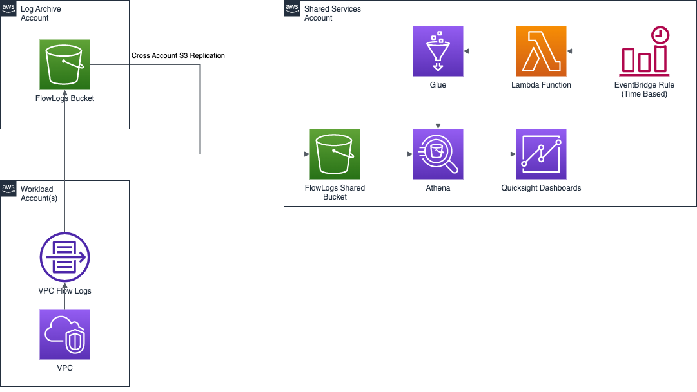

# VPC FlowLogs and Quicksight Dashboards

The CloudFormation Template and Lambda Function have been adapted from the original source [VPC FlowLogs Analysis Dashboard](https://wellarchitectedlabs.com/security/300_labs/300_vpc_flow_logs_analysis_dashboard/).

## Architecture Overview



## Pre-Requisites for the Solution
There is an overarching assumption that you already have [Customisation for Control Tower](https://aws.amazon.com/solutions/implementations/customizations-for-aws-control-tower/) deployed within your Control Tower Environment along with the [Security Reference Architecture (SRA)](https://github.com/aws-samples/aws-security-reference-architecture-examples).

### Pre-Requisites for `Centralised FlowLogs Module`
1.  Copy both `centralised-flowlogs-bucket.yaml` and `centralised-flowlogs-shared-bucket.yaml` to the SRA Staging S3 Bucket in the Control Tower Management Account and place them in a prefix named `custom_templates\flowlogs`.
2.  This assumes that an additional AWS Account has already been provisioned for Shared Services.
3.  An S3 Bucket has been created in the Shared Services Account for Athena Query Results to be stored.
4.  Change the URL on Lines 203 and 280 to reflect the correct S3 Staging Bucket created by the Security Reference Architecture.

### Installation for `Centralised FlowLogs Module`
1.  Copy the CloudFormation Template `centralised-flowlogs-module.yaml` to the `/templates` folder for use with Customisations for Control Tower.
2.  Copy the CloudFormation Parameters `centralised-flowlogs-module.json` to the `/parameters` folder for use with Customisations for Control Tower.
3.  Update the CloudFormation Parameters `centralised-flowlogs-module.json` with the required details:
    * **pLogArchiveAccountId:** This is the AWS Account ID of the Account that has been configured by Control Tower as the Log Archive.
    * **pSharedServicesAccountId:** This is the AWS Account ID of the Account that has been configured for Shared Services.
    * **pS3LifeCycleTransition:** This is the number of days before the object published to the S3 Bucket will be transitioned to Amazon S3 Glacier.
    * **pAthenaQueryResultBucketArn:** This is the ARN of the S3 Bucket that will be used in the Shared Services Account for Athena Query Results to be stored.

    The below Parameters are used for Tagging Purposes and cannot be left blank.

    * **pTagEnvironment:** Distinguish between Production & Non-Production Environments AWS Accounts.
    * **pTagSDLC:** Distinguish between SDLC Environments e.g., Dev, Test, SIT, UAT.
    * **pTagApplicationName:** Identify resources that are related to a specific application.
    * **pTagApplicationRole:** Identify the function of a particular respource e.g., Web Server, Message Broker, Database Server.
    * **pTagCluster:** Identify resource farms that share a common configuration and that perform a specific function for an application.
    * **pTagDataClassification:** Identify the specific compliance requirements that resources must adhere to e.g., FedRAMP Moderate, Australian Cyber, ITAR etc.
    * **pTagCompliance:** Identify the specific data confidentiality level a resource supports.
    * **pTagDataRetention:** Identify the data retention policy applied to a resource.
    * **pTagMapMigrated:** Identify resources that have been migrated as part of the AWS Migration Acceleration Program (MAP) for funding purposes.
    * **pTagProjectName:** Identify the project that the resource supports.
    * **pTagProductOwner:** Identify who is commercially responsible for the resource.
    * **pTagTechnicalOwner:** Identify who is technically responsible for the resource.
    * **pTagCostCenter:** Identify the cost center associated with a resource, typically for cost allocation and tracking.
    * **pTagBusinessUnit:**  Identify the business unit associated with a resource, typically for cost allocation and tracking.
    * **pTagBusinessImpact:** Identify the business impact associated with a resource e.g., Critical, High, Medium, Low.
    * **pTagEscalationPath:** Identify the next point of contact for a resource in an incident e.g, DevOps Team, 3rd Party Company.
    * **pTagKnowledgeBase:** Identify the location for knowledge base article or wiki associated with the resource.
    * **pTagHoursOfOperation:** Identify the hours of operation for a resource e.g., 24*7, 06:00 – 22:00 Monday – Friday, 08:00 – 18:00 Monday – Friday.
    * **pTagMaintenanceWindow:** Identify the hours in which.a resource is available for maintenance occur
    * **pTagBackupSchedule:** Identify the backup schedule for a resource.
    * **pTagOptOut:** Identify whether a resource should be excluded from maintenance activities e.g., True, False.
    * **pTagDeploymentMethod:** Identify the method by which the resource was deployed e.g., CloudFormation, Terraform, Manual.

```json
[
    {
        "ParameterKey": "pLogArchiveAccountId",
        "ParameterValue": ""
    },
    {
        "ParameterKey": "pSharedServicesAccountId",
        "ParameterValue": ""
    },
    {
        "ParameterKey": "pS3LifeCycleTransition",
        "ParameterValue": ""
    },
    {
        "ParameterKey": "pAthenaQueryResultBucketArn",
        "ParameterValue": ""
    },
    {
        "ParameterKey": "pTagEnvironment",
        "ParameterValue": ""
    },
    {
        "ParameterKey": "pTagSDLC",
        "ParameterValue": ""
    },
    {
        "ParameterKey": "pTagApplicationName",
        "ParameterValue": ""
    },
    {
        "ParameterKey": "pTagApplicationRole",
        "ParameterValue": ""
    },
    {
        "ParameterKey": "pTagCluster",
        "ParameterValue": ""
    },
    {
        "ParameterKey": "pTagDataClassification",
        "ParameterValue": ""
    },
    {
        "ParameterKey": "pTagCompliance",
        "ParameterValue": ""
    },
    {
        "ParameterKey": "pTagDataRetention",
        "ParameterValue": ""
    },
    {
        "ParameterKey": "pTagMapMigrated",
        "ParameterValue": ""
    },
    {
        "ParameterKey": "pTagProjectName",
        "ParameterValue": ""
    },
    {
        "ParameterKey": "pTagProductOwner",
        "ParameterValue": ""
    },
    {
        "ParameterKey": "pTagTechnicalOwner",
        "ParameterValue": ""
    },
    {
        "ParameterKey": "pTagCostCenter",
        "ParameterValue": ""
    },
    {
        "ParameterKey": "pTagBusinessUnit",
        "ParameterValue": ""
    },
    {
        "ParameterKey": "pTagBusinessImpact",
        "ParameterValue": ""
    },
    {
        "ParameterKey": "pTagEscalationPath",
        "ParameterValue": ""
    },
    {
        "ParameterKey": "pTagKnowledgeBase",
        "ParameterValue": ""
    },
    {
        "ParameterKey": "pTagHoursOfOperation",
        "ParameterValue": ""
    },
    {
        "ParameterKey": "pTagMaintenanceWindow",
        "ParameterValue": ""
    },
    {
        "ParameterKey": "pTagBackupSchedule",
        "ParameterValue": ""
    },
    {
        "ParameterKey": "pTagOptOut",
        "ParameterValue": ""
    },
    {
        "ParameterKey": "pTagDeploymentMethod",
        "ParameterValue": ""
    }

]
```

4.  Update the `manifest.yaml` and configure the `deployment_targets` accordingly based on your needs. The deployment target should be the AWS Control Tower Management Account.

```yaml
  - name: centralised-flowlogs-dashboards-module
    resource_file: templates/centralised-flowlogs-dashboards-module.yaml
    parameter_file: parameters/centralised-flowlogs-dashboards-module.json
    deploy_method: stack_set
    deployment_targets:
      accounts:
        - # Either the 12-digit Account ID or the Logical Name for the Control Tower Management Account

```

### Pre-Requisites for `Centralised FlowLogs Dashboards Module`
1.  Copy both `centralised-flowlogs-core-infrastructure.yaml` and `centralised-flowlogs-quicksight-dashboards.yaml` to the SRA Staging S3 Bucket in the Control Tower Management Account and place them in a prefix named `custom_templates\flowlogs`.
2.  Ensure that the `Centralised FlowLogs Module` has been successfully deployed.
3.  Ensure that a VPC has been provisioned that has VPC FlowLogs configured and is also configured to send them to the S3 Bucket Created in `centralised-flowlogs-bucket.yaml`.  Once configured wait for some traffic to have been written and confirm that object are appering in the S3 Bucket.
4.  Change the URL on Lines 214 and 293 to reflect the correct S3 Staging Bucket created by the Security Reference Architecture.
5.  Ensure that QuickSight is configured in the Shared Services AWS Account. This includes configuring the Security settings within Quicksight so that the Quicksight Service has permissions to the S3 Bucket provisioned by `centralised-flowlogs-shared-bucket.yaml` as well as the Athena Query Results Bucket and Amazon Athena. Also ensure that the SPICE Capacity has at least 20GB spare, if not provision some more - this can always be freed up later.

### Installation for `Centralised FlowLogs Dashboards Module`

1.  Copy the CloudFormation Template `centralised-flowlogs-dashboards-module.yaml` to the `/templates` folder for use with Customisations for Control Tower.
2.  Copy the CloudFormation Parameters `centralised-flowlogs-dashboards-module.json` to the `/parameters` folder for use with Customisations for Control Tower.
3.  Update the CloudFormation Parameters `centralised-flowlogs-dashboards-module.json` with the required details:
    * **pAthenaQueryResultBucketArn:** This is the ARN of the S3 Bucket that will be used in the Shared Services Account for Athena Query Results to be stored.
    * **pAthenaResultsOutputLocation:** This is the URI of the S3 Bucket that will be used in the Shared Services Account for Athena Query Results to be stored.
    * **pVpcFlowLogsBucketName:** This is the name of the S3 Bucket provisioned by `centralised-flowlogs-shared-bucket.yaml`.
    * **pVpcFlowLogsS3BucketLocation:** This is the URI of the Bucket provisioned by `centralised-flowlogs-shared-bucket.yaml`.
    * **pQuickSightUser:**  This is the Quicksight User that will be the owner of the QuickSight Datasets and Dashboards.
    * **pVpcFlowLogsAthenaDatabase:** This is the name of the Glue Database that the QuickSight Dashboards will be using to query. This should be configured to `vpcflowlogsathenadatabase`.

    The below Parameters are used for Tagging Purposes and cannot be left blank.

    * **pTagEnvironment:** Distinguish between Production & Non-Production Environments AWS Accounts.
    * **pTagSDLC:** Distinguish between SDLC Environments e.g., Dev, Test, SIT, UAT.
    * **pTagApplicationName:** Identify resources that are related to a specific application.
    * **pTagApplicationRole:** Identify the function of a particular respource e.g., Web Server, Message Broker, Database Server.
    * **pTagCluster:** Identify resource farms that share a common configuration and that perform a specific function for an application.
    * **pTagDataClassification:** Identify the specific compliance requirements that resources must adhere to e.g., FedRAMP Moderate, Australian Cyber, ITAR etc.
    * **pTagCompliance:** Identify the specific data confidentiality level a resource supports.
    * **pTagDataRetention:** Identify the data retention policy applied to a resource.
    * **pTagMapMigrated:** Identify resources that have been migrated as part of the AWS Migration Acceleration Program (MAP) for funding purposes.
    * **pTagProjectName:** Identify the project that the resource supports.
    * **pTagProductOwner:** Identify who is commercially responsible for the resource.
    * **pTagTechnicalOwner:** Identify who is technically responsible for the resource.
    * **pTagCostCenter:** Identify the cost center associated with a resource, typically for cost allocation and tracking.
    * **pTagBusinessUnit:**  Identify the business unit associated with a resource, typically for cost allocation and tracking.
    * **pTagBusinessImpact:** Identify the business impact associated with a resource e.g., Critical, High, Medium, Low.
    * **pTagEscalationPath:** Identify the next point of contact for a resource in an incident e.g, DevOps Team, 3rd Party Company.
    * **pTagKnowledgeBase:** Identify the location for knowledge base article or wiki associated with the resource.
    * **pTagHoursOfOperation:** Identify the hours of operation for a resource e.g., 24*7, 06:00 – 22:00 Monday – Friday, 08:00 – 18:00 Monday – Friday.
    * **pTagMaintenanceWindow:** Identify the hours in which.a resource is available for maintenance occur
    * **pTagBackupSchedule:** Identify the backup schedule for a resource.
    * **pTagOptOut:** Identify whether a resource should be excluded from maintenance activities e.g., True, False.
    * **pTagDeploymentMethod:** Identify the method by which the resource was deployed e.g., CloudFormation, Terraform, Manual.

```json
[
    {
        "ParameterKey": "pLogArchiveAccountId",
        "ParameterValue": ""
    },
    {
        "ParameterKey": "pSharedServicesAccountId",
        "ParameterValue": ""
    },
    {
        "ParameterKey": "pS3LifeCycleTransition",
        "ParameterValue": ""
    },
    {
        "ParameterKey": "pAthenaQueryResultBucketArn",
        "ParameterValue": ""
    },
    {
        "ParameterKey": "pTagEnvironment",
        "ParameterValue": ""
    },
    {
        "ParameterKey": "pTagSDLC",
        "ParameterValue": ""
    },
    {
        "ParameterKey": "pTagApplicationName",
        "ParameterValue": ""
    },
    {
        "ParameterKey": "pTagApplicationRole",
        "ParameterValue": ""
    },
    {
        "ParameterKey": "pTagCluster",
        "ParameterValue": ""
    },
    {
        "ParameterKey": "pTagDataClassification",
        "ParameterValue": ""
    },
    {
        "ParameterKey": "pTagCompliance",
        "ParameterValue": ""
    },
    {
        "ParameterKey": "pTagDataRetention",
        "ParameterValue": ""
    },
    {
        "ParameterKey": "pTagMapMigrated",
        "ParameterValue": ""
    },
    {
        "ParameterKey": "pTagProjectName",
        "ParameterValue": ""
    },
    {
        "ParameterKey": "pTagProductOwner",
        "ParameterValue": ""
    },
    {
        "ParameterKey": "pTagTechnicalOwner",
        "ParameterValue": ""
    },
    {
        "ParameterKey": "pTagCostCenter",
        "ParameterValue": ""
    },
    {
        "ParameterKey": "pTagBusinessUnit",
        "ParameterValue": ""
    },
    {
        "ParameterKey": "pTagBusinessImpact",
        "ParameterValue": ""
    },
    {
        "ParameterKey": "pTagEscalationPath",
        "ParameterValue": ""
    },
    {
        "ParameterKey": "pTagKnowledgeBase",
        "ParameterValue": ""
    },
    {
        "ParameterKey": "pTagHoursOfOperation",
        "ParameterValue": ""
    },
    {
        "ParameterKey": "pTagMaintenanceWindow",
        "ParameterValue": ""
    },
    {
        "ParameterKey": "pTagBackupSchedule",
        "ParameterValue": ""
    },
    {
        "ParameterKey": "pTagOptOut",
        "ParameterValue": ""
    },
    {
        "ParameterKey": "pTagDeploymentMethod",
        "ParameterValue": ""
    }

]
```

4.  Update the `manifest.yaml` and configure the `deployment_targets` accordingly based on your needs. The deployment target should be the AWS Control Tower Management Account.

```yaml
  - name: centralised-flowlogs-module
    resource_file: templates/centralised-flowlogs-module.yaml
    parameter_file: parameters/centralised-flowlogs-module.json
    deploy_method: stack_set
    deployment_targets:
      accounts:
        - # Either the 12-digit Account ID or the Logical Name for the Control Tower Management Account

```