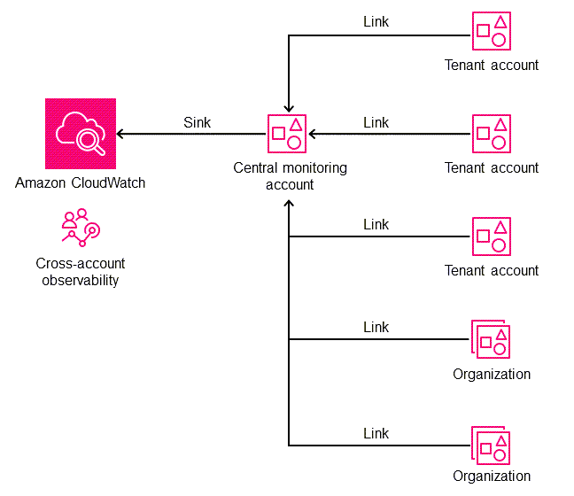

# CloudWatch OAM Module
- [CloudWatch OAM Module](#cloudwatch-oam-module)
  - [Architecture Overview](#architecture-overview)
  - [Pre-Requisites for the Solution](#pre-requisites-for-the-solution)
  - [Pre-Requisites for `CloudWatch OAM Module` into the Nested Stacks Pipeline](#pre-requisites-for-cloudwatch-oam-module-into-the-nested-stacks-pipeline)
  - [Installation for `CloudWatch OAM Module` into the Nested Stacks Pipeline](#installation-for-cloudwatch-oam-module-into-the-nested-stacks-pipeline)
  - [Upload of the build files to the `CloudWatch OAM Module` Nested Stack Pipeline CodeCommit repo](#upload-of-the-build-files-to-the-cloudwatch-oam-module-nested-stack-pipeline-codecommit-repo)

## Architecture Overview



## Pre-Requisites for the Solution
- There is an overarching assumption that you already have [Customisation for Control Tower](https://aws.amazon.com/solutions/implementations/customizations-for-aws-control-tower/) deployed within your Control Tower Environment along with the [Security Reference Architecture (SRA)](https://github.com/aws-samples/aws-security-reference-architecture-examples).

- Before deployment you are required to initialise the Nested Stacks pipeline from CfCT. [Nested Stacks Pipeline](../../../readme.md)

    i.e. `Repo deployed with at least a scripts folder and running pipeline`

## Pre-Requisites for `CloudWatch OAM Module` into the Nested Stacks Pipeline
1. Copy the following yaml files into your `Nested-Stack-Modules` repo in the Control Tower Management Account in to the templates folder

    - `cloudwatch-oam-sink.yaml`
    - `cloudwatch-oam-link.yaml`

    copy to the following structure

    - `templates\cloudwatch-oam\nested\` (Case sensative)

## Installation for `CloudWatch OAM Module` into the Nested Stacks Pipeline
1.  Copy the CloudFormation Template `cloudwatch-oam-module.yaml` to the `/templates` folder for use with Customisations for Control Tower.
2.  Copy the CloudFormation Parameters `cloudwatch-oam-module-parameters.json` to the `/parameters` folder for use with Customisations for Control Tower.
3.  Update the CloudFormation Parameters `cloudwatch-oam-module-parameters.json` with the required details:

    | ParameterKey | Description | DefaultValue |
    | ------------ | ----------- | ------------ |
    | pGLCTSolutionVersion | The Global Logic solution version. Used to trigger updates on the nested StackSets. | v1.0 |
    | pS3BaseURLForNestedTemplates | The S3 tempaltes bucket use in the Nested Stacks Pipeline | https://nested-stacks-codepipeline-artefacts-{region}-{account_id}.s3.{region}.amazonaws.com/ |
    | pMonitoringAccountId | Account ID, Used for the Monitoring account | |
    | pSourceAccountOUs |  (Ex: r-ab01,ou-ab01-abcd1234) List of Organizational Unit IDs you wish to collect data for. It can be a single organizational unit. ||

Examples Below:

```json
[
    {
        "ParameterKey": "pGLCTSolutionVersion",
        "ParameterValue": "v1.0"
    },
    {
        "ParameterKey": "pS3BaseURLForNestedTemplates",
        "ParameterValue": "https://nested-stacks-codepipeline-artefacts-{region}-{account_id}.s3.{region}.amazonaws.com/"
    },
    {
        "ParameterKey": "pMonitoringAccountId",
        "ParameterValue": "010662631564"
    },
    {
        "ParameterKey": "pSourceAccountOUs",
        "ParameterValue": "ou-ijgf-yvuzipm1,ou-ijgf-cqmgdh2i,ou-ijgf-poep3iok"
    },
    {
        "ParameterKey": "pIncludeManagementAsSource",
        "ParameterValue": "yes"
    }

]
```

The below Parameters are some of the examples used for Tagging Purposes and cannot be left blank.

| ParameterKey | Description | DefaultValue |
| ------------ | ----------- | ------------ |
| pTagEnvironment | Distinguish between Production & Non-Production Environments AWS Accounts. | |
| pTagSDLC | Distinguish between SDLC Environments e.g., Dev, Test, SIT, UAT. ||
| pTagApplicationName | Identify resources that are related to a specific application. ||
| pTagApplicationRole | Identify the function of a particular respource e.g., Web Server, Message Broker, Database Server. ||
| pTagCluster | Identify resource farms that share a common configuration and that perform a specific function for an application. ||
| pTagDataClassification | Identify the specific compliance requirements that resources must adhere to e.g., FedRAMP Moderate, Australian Cyber, ITAR etc. | Private |
| pTagCompliance | Identify the specific data confidentiality level a resource supports. ||
| pTagDataRetention | Identify the data retention policy applied to a resource. | 365 |
| pTagMapMigrated | Identify resources that have been migrated as part of the AWS Migration Acceleration Program (MAP) for funding purposes. ||
| pTagProjectName | Identify the project that the resource supports. ||
| pTagProductOwner | Identify who is commercially responsible for the resource. ||
| pTagTechnicalOwner | Identify who is technically responsible for the resource. ||
| pTagCostCenter | Identify the cost center associated with a resource, typically for cost allocation and tracking. ||
| pTagBusinessUnit | Identify the business unit associated with a resource, typically for cost allocation and tracking. ||
| pTagBusinessImpact | Identify the business impact associated with a resource e.g., Critical, High, Medium, Low. | Medium |
| pTagEscalationPath | Identify the next point of contact for a resource in an incident e.g, DevOps Team, 3rd Party Company. ||
| pTagKnowledgeBase | Identify the location for knowledge base article or wiki associated with the resource. ||
| pTagHoursOfOperation | Identify the hours of operation for a resource e.g., 24*7, 06:00 – 22:00 Monday – Friday, 08:00 – 18:00 Monday – Friday. | 24x7 |
| pTagMaintenanceWindow | Identify the hours in which.a resource is available for maintenance occur ||
| pTagBackupSchedule | Identify the backup schedule for a resource. ||
| pTagOptOut | Identify whether a resource should be excluded from maintenance activities e.g., True, False. | False |
| pTagDeploymentMethod | Identify the method by which the resource was deployed e.g., CloudFormation, Terraform, Manual. | CloudFormation |


```json
[
    {
        "ParameterKey": "pTagEnvironment",
        "ParameterValue": ""
    },
    {
        "ParameterKey": "pTagSDLC",
        "ParameterValue": ""
    },
    {
        "ParameterKey": "pTagApplicationName",
        "ParameterValue": ""
    },
    {
        "ParameterKey": "pTagApplicationRole",
        "ParameterValue": ""
    },
    {
        "ParameterKey": "pTagCluster",
        "ParameterValue": ""
    },
    {
        "ParameterKey": "pTagDataClassification",
        "ParameterValue": "Private"
    },
    {
        "ParameterKey": "pTagCompliance",
        "ParameterValue": ""
    },
    {
        "ParameterKey": "pTagDataRetention",
        "ParameterValue": "365"
    },
    {
        "ParameterKey": "pTagMapMigrated",
        "ParameterValue": ""
    },
    {
        "ParameterKey": "pTagProjectName",
        "ParameterValue": ""
    },
    {
        "ParameterKey": "pTagProductOwner",
        "ParameterValue": ""
    },
    {
        "ParameterKey": "pTagTechnicalOwner",
        "ParameterValue": ""
    },
    {
        "ParameterKey": "pTagCostCenter",
        "ParameterValue": ""
    },
    {
        "ParameterKey": "pTagBusinessUnit",
        "ParameterValue": ""
    },
    {
        "ParameterKey": "pTagBusinessImpact",
        "ParameterValue": "Medium"
    },
    {
        "ParameterKey": "pTagEscalationPath",
        "ParameterValue": ""
    },
    {
        "ParameterKey": "pTagKnowledgeBase",
        "ParameterValue": ""
    },
    {
        "ParameterKey": "pTagHoursOfOperation",
        "ParameterValue": "24x7"
    },
    {
        "ParameterKey": "pTagMaintenanceWindow",
        "ParameterValue": ""
    },
    {
        "ParameterKey": "pTagBackupSchedule",
        "ParameterValue": ""
    },
    {
        "ParameterKey": "pTagOptOut",
        "ParameterValue": "False"
    },
    {
        "ParameterKey": "pTagDeploymentMethod",
        "ParameterValue": "CloudFormation"
    }
]
```

## Upload of the build files to the `CloudWatch OAM Module` Nested Stack Pipeline CodeCommit repo

1. The CodeCommit repo will be created in the Security Account, you will need to establish a SSO / programmatic session to the account and ensure that you have git: `remote-codecommit` installed locally
2. Once you have a session git clone the repo to your machine with the relevant command based on your setup. i.e.
   ```bash
   git clone codecommit::eu-west-2://Nested-Stacks-Pipeline
   # Or if using profiles
   git clone codecommit://<PROFILE>@Nested-Stacks-Pipeline
   ```
3. Git add the files as above then commit and push
    ```bash
    git add .
    git commit -m "Initial Commit"
    git push
    ```
4. The push to the repo will launch the build and will automatically deploy the latest version