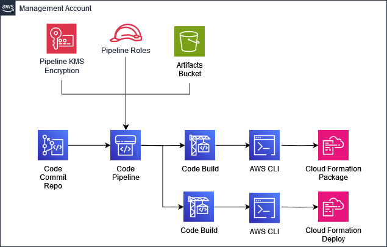

# Nested Stacks Pipeline

- [Nested Stacks Pipeline](#nested-stacks-pipeline)
  - [Description](#description)
  - [Architecture Overview](#architecture-overview)
  - [Installation for the Nested Stacks Pipeline](#installation-for-the-nested-stacks-pipeline)
  - [Installing Modules for the Nested Stacks Pipeline](#installing-modules-for-the-nested-stacks-pipeline)

## Description

Functionality of the `Nested Stacks Pipeline` solution is established in 3 stages, the deployment of the Pipeline through CfCT, and the deployment of the GL Custom solutions from the following locations.

  1. [CloudFormation](./CloudFormation/) - Deployment of the Pipeline via the CFN template via CfCT
  2. [Pipeline](./CloudFormation-Modules/scripts) - Configuration of the pipeline including uploading the required .sh scripts and creating the folder structure
  3. [CloudFormation-Modules](./CloudFormation-Modules/) - Applying modules through the created `Nested-Stack-Modules` repo for the chosen solutions

## Architecture Overview



## Installation for the Nested Stacks Pipeline

1.  Copy the CloudFormation Template `custom-nested-stacks-pipeline.yaml` to the `/templates` folder of the use with Customisations for Control Tower.
2.  Copy the CloudFormation Parameters `custom-nested-stacks-pipeline.json` to the `/parameters` folder for use with Customisations for Control Tower.
3.  Update the CloudFormation Parameters `custom-nested-stacks-pipeline.json` with the required details:

    | ParameterKey | Description | DefaultValue |
    | ------------ | ----------- | ------------ |
    | pRepositoryName | This is the Name of Code Commit Repository | Nested-Stack-Modules |
    | pS3LifeCycleTransition | This is the Number of Days to retain the logs in Amazon S3 before transitioning the Logs to Amazon S3 Glacier. | 30 |
    | pS3LifeCycleExpiration | This is the data retention policy applied to the resources (S3, ECR, CloudWatch Logs, EC2 AMI, EBS Snapshots, RDS Snapshot) | 365 |

```json
[
    {
        "ParameterKey": "pRepositoryName",
        "ParameterValue": "Nested-Stack-Modules"
    },
    {
        "ParameterKey": "pS3LifeCycleTransition",
        "ParameterValue": "30"
    },
    {
        "ParameterKey": "pS3LifeCycleExpiration",
        "ParameterValue": "365"
    }
]
```

The below Parameters are some of the examples used for Tagging Purposes and cannot be left blank.

| ParameterKey | Description | DefaultValue |
| ------------ | ----------- | ------------ |
| pTagEnvironment | Distinguish between Production & Non-Production Environments AWS Accounts. | |
| pTagSDLC | Distinguish between SDLC Environments e.g., Dev, Test, SIT, UAT. ||
| pTagApplicationName | Identify resources that are related to a specific application. ||
| pTagApplicationRole | Identify the function of a particular respource e.g., Web Server, Message Broker, Database Server. ||
| pTagCluster | Identify resource farms that share a common configuration and that perform a specific function for an application. ||
| pTagDataClassification | Identify the specific compliance requirements that resources must adhere to e.g., FedRAMP Moderate, Australian Cyber, ITAR etc. | Private |
| pTagCompliance | Identify the specific data confidentiality level a resource supports. ||
| pTagDataRetention | Identify the data retention policy applied to a resource. | 365 |
| pTagMapMigrated | Identify resources that have been migrated as part of the AWS Migration Acceleration Program (MAP) for funding purposes. ||
| pTagProjectName | Identify the project that the resource supports. ||
| pTagProductOwner | Identify who is commercially responsible for the resource. ||
| pTagTechnicalOwner | Identify who is technically responsible for the resource. ||
| pTagCostCenter | Identify the cost center associated with a resource, typically for cost allocation and tracking. ||
| pTagBusinessUnit | Identify the business unit associated with a resource, typically for cost allocation and tracking. ||
| pTagBusinessImpact | Identify the business impact associated with a resource e.g., Critical, High, Medium, Low. | Medium |
| pTagEscalationPath | Identify the next point of contact for a resource in an incident e.g, DevOps Team, 3rd Party Company. ||
| pTagKnowledgeBase | Identify the location for knowledge base article or wiki associated with the resource. ||
| pTagHoursOfOperation | Identify the hours of operation for a resource e.g., 24*7, 06:00 – 22:00 Monday – Friday, 08:00 – 18:00 Monday – Friday. | 24x7 |
| pTagMaintenanceWindow | Identify the hours in which.a resource is available for maintenance occur ||
| pTagBackupSchedule | Identify the backup schedule for a resource. ||
| pTagOptOut | Identify whether a resource should be excluded from maintenance activities e.g., True, False. | False |
| pTagDeploymentMethod | Identify the method by which the resource was deployed e.g., CloudFormation, Terraform, Manual. | CloudFormation |


```json
[
    {
        "ParameterKey": "pTagEnvironment",
        "ParameterValue": ""
    },
    {
        "ParameterKey": "pTagSDLC",
        "ParameterValue": ""
    },
    {
        "ParameterKey": "pTagApplicationName",
        "ParameterValue": ""
    },
    {
        "ParameterKey": "pTagApplicationRole",
        "ParameterValue": ""
    },
    {
        "ParameterKey": "pTagCluster",
        "ParameterValue": ""
    },
    {
        "ParameterKey": "pTagDataClassification",
        "ParameterValue": "Private"
    },
    {
        "ParameterKey": "pTagCompliance",
        "ParameterValue": ""
    },
    {
        "ParameterKey": "pTagDataRetention",
        "ParameterValue": "365"
    },
    {
        "ParameterKey": "pTagMapMigrated",
        "ParameterValue": ""
    },
    {
        "ParameterKey": "pTagProjectName",
        "ParameterValue": ""
    },
    {
        "ParameterKey": "pTagProductOwner",
        "ParameterValue": ""
    },
    {
        "ParameterKey": "pTagTechnicalOwner",
        "ParameterValue": ""
    },
    {
        "ParameterKey": "pTagCostCenter",
        "ParameterValue": ""
    },
    {
        "ParameterKey": "pTagBusinessUnit",
        "ParameterValue": ""
    },
    {
        "ParameterKey": "pTagBusinessImpact",
        "ParameterValue": "Medium"
    },
    {
        "ParameterKey": "pTagEscalationPath",
        "ParameterValue": ""
    },
    {
        "ParameterKey": "pTagKnowledgeBase",
        "ParameterValue": ""
    },
    {
        "ParameterKey": "pTagHoursOfOperation",
        "ParameterValue": "24x7"
    },
    {
        "ParameterKey": "pTagMaintenanceWindow",
        "ParameterValue": ""
    },
    {
        "ParameterKey": "pTagBackupSchedule",
        "ParameterValue": ""
    },
    {
        "ParameterKey": "pTagOptOut",
        "ParameterValue": "False"
    },
    {
        "ParameterKey": "pTagDeploymentMethod",
        "ParameterValue": "CloudFormation"
    }
]
```
4.  Update the `manifest.yaml` and configure the `deployment_targets` accordingly based on your needs. The deployment target should be the AWS Control Tower Management Account.

```yaml
  - name: custom-
    resource_file: templates/custom-nested-stacks-pipeline.yaml
    parameter_file: parameters/custom-nested-stacks-pipeline-parameters.json
    deploy_method: stack_set
    deployment_targets:
      accounts:
        - # Either the 12-digit Account ID or the Logical Name for the Control Tower Management Account
```

5. Finally once the CfCT pipeline has ran successfully, you are required to now configure the pipeline.

  - Copy the `/scripts` Folder from [CloudFormation-Modules](./scripts/) into your `Nested-Stack-Modules` repo
    -  This will include the pipeline shell scripts required for the pipeline build.
  - Create 2 new folders `templates` and `parameters` in your repo.

     1. The CodeCommit repo will be created in the Management Account, you will need to establish a SSO / progromatic session to the account and ensure that you have git: `remote-codecommit` installed locally
     2. Once you have a session git clone the repo to your machine with the relevant command based on your setup. i.e. 
        ```bash
        git clone codecommit::eu-west-2://Nested-Stacks-Modules
        # Or if using profiles
        git clone codecommit://<PROFILE>@Nested-Stacks-Modules
        ```
    3. Git add the files as above then commit and push
        ```bash
        git add .
        git commit -m "Initial Commit"
        git push
        ```
## Installing Modules for the Nested Stacks Pipeline

- See instructions located in [templates](./CloudFormation-Modules/templates) for more information on the solution deployments
